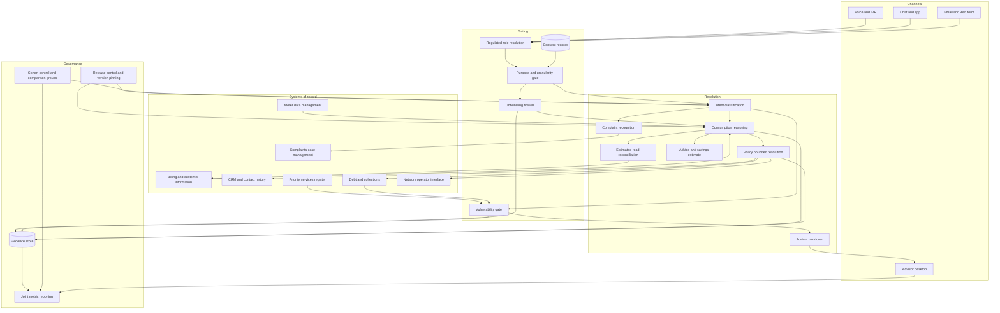

# Klarwatt

**Source:** `ai-in-energy/Accenture-ai-for-eu-utilities-WKaastra-transcript/`
**Domain:** `ai-energy`
**One-liner:** A front-office resolution layer for EU energy retailers that answers consumption and billing contacts from the customer's own metering data, and provably hands the contact to a person whenever unbundling rules, vulnerability protections, or metering-data purpose limits require one.
**Wedge:** Inbound "why is my bill higher" contacts at a residential supplier with 0.5–5M meter points in a rolled-out smart metering market — the highest-volume, lowest-margin contact class, and the one a knowledge-base chatbot cannot answer because the answer lives in half-hourly data, a tariff change, and a corrected estimated read.
**Positioning:** Regulated contact automation for energy retail. Generic customer-service AI treats an energy supplier as a call centre with a knowledge base; Klarwatt treats it as a licensed entity whose every automated utterance is constrained by the role it is speaking in, the lawful purpose of the data it used, and the protected status of the person it is speaking to — and makes the pilot-to-scale decision a measured event rather than a board-level hunch.

## Market research synthesis

### Thesis from source

The source is a short 2018 Accenture video transcript from Wytse Kaastra, Managing Director for Energy Retail and Customer Services. It is a diagnosis rather than a design, and it makes four claims worth taking literally. First, that artificial intelligence is almost at the tipping point of breaking through, and that this will be one of the big revolutions in customer service — allowing both a much better customer experience and a much lower cost. Second, and most usefully, that robotic process automation in the back office is quite mature already, but the next wave, clearly, is in the front offices and the customer interaction on the phone but also through all the digital channels. Third, that new services around energy management are available: providing more insights into consumption, providing more advice, with AI playing a critical role to provide a better service at a lower price point. Fourth, on timing and strategy: every utility will have their own approach, but the advice is to stay in front of the innovation — do pilots and proofs of concept, understand who the providers are, run small pilots in order to learn, build skills, and understand what works and what doesn't work, and once you find the technology that is really able to scale, you can be the first one to bring it at massive scale to the market, which is a competitive advantage.

Two things follow from reading this as a business brief. The transcript locates the opportunity in the front office specifically because the back office is done — the easy, deterministic, internally-facing work has already been automated. What remains is the part that touches a customer, and in energy retail that part is regulated. Every automated interaction happens inside a licensed relationship. So the interesting engineering problem is not intent classification; it is whether an automated agent may say a given thing to a given person using a given piece of data.

That constraint has hard European shape. Unbundling rules separate the network operator from the supplier: a distribution system operator may not use its network position to advantage an affiliated supply business, and data flowing from the network side carries purpose restrictions that do not disappear because the same corporate group owns both. Smart meter interval consumption is personal data — half-hourly readings reveal occupancy, appliance use, and absence — so its use for advice or upsell requires a lawful basis with purpose limitation and granularity restraint, and in several member states granularity above a defined resolution requires explicit consent. Vulnerable and protected customers have statutory shielding: an automated conversation drifting toward arrears, disconnection, prepayment self-disconnection, or a medical dependency on supply is a conversation that must reach a human being, and getting that wrong is a licence condition breach rather than a poor customer-experience metric. Estimated versus actual reads and their later correction sit underneath most bill disputes, and imbalance settlement means the supplier's own cost position moves with metering data quality, so a wrong explanation to the customer often signals a real data defect upstream.

The transcript's second half is a maturity argument that the product must implement rather than admire. Pilots that teach the organisation what works, followed by being first to scale, only produce competitive advantage if the pilot generates a decision-grade measurement. In practice most utility front-office pilots die because containment rate was measured without complaint rate, or cost per contact was measured without first-contact resolution, so nobody can distinguish deflection from abandonment. Klarwatt therefore treats the transcript's advice as a requirement: every automated capability runs inside a cohort with a defined comparison group and a scale-or-stop decision date, on metrics that make a deflection-versus-resolution distinction impossible to hide.

### Buyer & economic model

- **Primary buyer:** Director of Customer Operations or Head of Retail Customer Service at a supplier, co-sponsored by the Chief Commercial Officer who owns cost-to-serve and by the Compliance Director who owns the licence.
- **Users:** contact centre advisors and team leaders (continuously, as the escalation destination), a vulnerability or priority-services team (per escalation), billing and revenue operations analysts (estimated read and settlement defects), data protection and compliance officers (purpose and consent review), regulatory reporting staff (complaint and ombudsman submissions), and the retail analytics team running pilot cohorts.
- **Budget owner / value metric:** the cost-to-serve line in retail operations. The value metric is fully-loaded cost per resolved contact, paired with first-contact resolution and complaint rate so that deflection is never mistaken for resolution. Secondary metrics are advisor handling time released for high-value work, reduction in bill-dispute volume, and the share of automated resolutions that survive an ombudsman review unchanged.
- **Competing status quo:** an interactive voice response tree, a knowledge-base chatbot that cannot read the meter data and therefore hands off almost everything, a self-service portal showing raw consumption graphs the customer does not interpret, and a contact centre where the same bill-shock conversation is repeated tens of thousands of times each winter. Some suppliers have layered a general-purpose conversational AI over the knowledge base; it fails on exactly the contacts that drive volume, because the answer requires reasoning over the customer's own interval data rather than retrieval of a policy page.

### Domain constraints

- **Regulatory / trust / safety:** licence conditions on complaint handling, billing accuracy, and treatment of customers in payment difficulty apply to an automated agent exactly as to a human advisor. Unbundling requires that a supply-side automated agent not use network-side data or influence beyond its permitted purpose, and that an affiliated supplier receive no informational advantage from the network business. Vulnerability and priority-services status triggers mandatory human handling for arrears, disconnection, self-disconnection on prepayment, and any indication of medical dependence on supply or of a safeguarding concern. Complaints must be recognised and logged the moment they are expressed, including inside an automated conversation, and be escalable to an ombudsman with the full interaction record. Any advice with a financial implication — a tariff switch, a payment plan — must be given on a documented policy basis, since it edges toward regulated advice.
- **Data sensitivity:** interval consumption data is personal data that reveals occupancy patterns and behaviour inside the home; its use requires a lawful basis, purpose limitation, and granularity proportionate to the purpose, with explicit consent for finer resolution in several member states. Contact recordings and transcripts are personal data and often contain special-category information, because a customer explaining why they cannot pay frequently discloses health or family circumstances. Data acquired for settlement or network operation may not be silently repurposed for marketing. Every automated response must be able to state which data it used and under which purpose, which means purpose has to be a first-class runtime input rather than a policy document.
- **Change-management realities:** advisor trust is the adoption gate — if escalations arrive without context, advisors route around the system and containment collapses. Contact volume is sharply seasonal and correlated with weather and with price changes, so a pilot run in a mild spring will overstate performance for the following winter. Legacy billing platforms often expose reads on a nightly batch, which caps how current an explanation can be and must be disclosed rather than hidden. Works councils and unions in several European markets require consultation where automation changes advisor roles, so a deployment plan that assumes headcount reduction as the first-order benefit will stall. And the transcript's own framing applies: pilots exist to learn what works and what does not, which only holds if stopping is a permitted, expected outcome.

## Business requirements

- BR-1: Every automated resolution must be able to state, on demand, which customer data it used and under which lawful purpose, and a response that cannot produce that statement must not be sent.
- BR-2: An automated agent must operate in exactly one declared regulated role per interaction — supplier, network operator, or affiliated service provider — and must not use data or grant advantage across that boundary.
- BR-3: Any contact that touches arrears, disconnection, prepayment self-disconnection, medical dependence on supply, or a safeguarding concern must be transferred to a trained human before any outcome is proposed, and this transfer must not be defeatable by configuration.
- BR-4: An expression of dissatisfaction inside an automated conversation must be recognised and logged as a complaint at the moment it occurs, with the same regulatory clock as a complaint raised to an advisor.
- BR-5: Consumption explanations must decompose a bill change into named, quantified drivers the customer can verify — weather, tariff change, consumption change, estimated-read correction, standing and network charges — rather than restate the total or present a raw graph.
- BR-6: Where an explanation depends on an estimated read, the estimate and its correction must be disclosed in the answer, and a suspected metering data defect must be raised to billing operations rather than absorbed into the customer explanation.
- BR-7: Cost per resolved contact must be reported jointly with first-contact resolution and complaint rate, so that a deflection can never be presented as a resolution.
- BR-8: Every automated capability must run inside a cohort with a defined comparison group and a scale-or-stop decision date, and stopping must be a recorded, unpenalised outcome.
- BR-9: Interval metering data must be used at the coarsest granularity that answers the question, with finer granularity requiring a recorded consent, and consent withdrawal must take effect on the next interaction.
- BR-10: Advice with a financial consequence must be traceable to an approved policy — payment plan affordability rules, tariff eligibility, exit fee treatment — and the platform must not generate a commitment outside that policy.
- BR-11: Escalations must arrive at the advisor with the full conversation, the data used, and the reason for escalation, because advisor trust determines whether automation holds under load.
- BR-12: Every change to an automated capability must be a versioned release with a named approver, and any interaction must be reconstructible against the version that served it for the full regulatory retention period.

## User stories

Canonical user stories live in sibling [USER_STORIES.md](USER_STORIES.md).

## System design

### Overview

Klarwatt sits in front of the supplier's existing channels and behind its systems of record. A contact arrives by voice, chat, app, or email and is resolved to an account, a meter point, and — critically — the regulated role the automated agent is permitted to speak in. Before any customer data is read, a purpose gate establishes the lawful purpose for this interaction and the maximum metering granularity that purpose supports, checking recorded consent where finer resolution is needed. Intent classification runs against that envelope. The consumption reasoning engine then decomposes the customer's question into quantified drivers by combining interval or daily reads, weather normalisation, tariff and network charge structure, and estimated-read history, and produces a plain-language explanation with each driver's contribution stated. Two independent gates run alongside: an unbundling check that blocks any use of network-side data or advantage outside the declared role, and a vulnerability gate that intercepts arrears, disconnection, medical-dependency, and safeguarding signals and transfers to a trained human before any outcome is proposed. Resolutions that are permitted — a re-read request, a within-policy payment plan proposal, a tariff eligibility check, a meter fault referral to the network operator — execute against systems of record. Complaint language is detected and logged with its regulatory clock. Every interaction is pinned to the capability version that served it and lands in an evidence store. Capabilities run inside cohorts with comparison groups and scale-or-stop decision dates, measured on cost per resolved contact jointly with first-contact resolution and complaint rate.

### Actors & boundaries

- **Actors:** residential customer, contact centre advisor and team leader, vulnerability and priority-services officer, billing and revenue operations analyst, compliance officer, data protection officer, regulatory reporting analyst, retail analytics lead, and platform owner.
- **Trust boundary:** the purpose gate is the boundary for personal data — no metering, contact, or account data reaches a reasoning step without a purpose and a granularity ceiling attached, and the record of that pairing is retained with the interaction. The unbundling boundary is separate and structural: network-side data enters only through permitted purposes, and the automated agent's declared role is fixed for the interaction rather than negotiable within it. The vulnerability gate sits outside commercial configuration entirely; containment targets have no authority over it. Special-category disclosures made in conversation are minimised in the retained record and are not available to marketing or pricing.
- **Human-in-the-loop points:** every arrears, disconnection, self-disconnection, medical-dependency, and safeguarding contact; any resolution outside approved policy; advisor correction of a wrong automated explanation; complaint handling beyond logging; consent capture for finer metering granularity; capability release approval; scale-or-stop decisions on cohorts.

### Core capabilities

1. **Contact intake and role resolution** — omnichannel intake with account and meter point resolution and determination of the regulated role the agent speaks in for this interaction.
2. **Purpose and consent gating** — lawful purpose selection, metering granularity ceiling per purpose, consent lookup and capture, and withdrawal taking effect on the next interaction.
3. **Unbundling firewall** — enforcement that supply-side automation does not use network-side data or confer affiliate advantage beyond permitted purposes, with every check recorded.
4. **Consumption reasoning** — decomposition of a bill or usage change into quantified drivers including weather normalisation, tariff and network charge changes, consumption change, and estimated-read correction.
5. **Estimated read and data defect handling** — disclosure of estimates and their corrections in the customer answer, and raising suspected metering data defects to billing operations as work items.
6. **Vulnerability detection and mandatory escalation** — interception of arrears, disconnection, prepayment self-disconnection, medical dependence, and safeguarding signals with unwaivable transfer to a trained human.
7. **Policy-bounded resolution** — execution of permitted outcomes such as re-read requests, within-policy payment plan proposals, tariff eligibility checks, and network fault referrals, with commitments outside policy blocked.
8. **Advice and energy management recommendations** — actionable conclusions with an estimated saving and a stated confidence, at the granularity the purpose permits.
9. **Complaint recognition and regulatory clock** — detection of dissatisfaction inside an automated conversation, immediate logging, and ombudsman-ready escalation.
10. **Advisor handover** — escalation packages carrying the conversation, the data used, the reason, and the proposed next step.
11. **Cohort governance and scale-or-stop** — comparison groups, weather and price-event adjustment, joint metric reporting, and recorded decisions to scale or stop.
12. **Release control and evidence** — versioned capability releases with named approvers, interaction-to-version pinning, and evidence pack generation.

### Conceptual data

- **Primary entities:** CustomerAccount, MeterPoint, TariffPlan, MeterReading, EstimatedReadCorrection, ConsentRecord, DataPurpose, RegulatedRole, ContactSession, Intent, ConsumptionExplanation, ExplanationDriver, VulnerabilityFlag, EscalationEvent, ResolutionAction, PaymentPlan, AdviceRecommendation, UnbundlingCheck, ComplaintCase, DataDefectReport, PilotCohort, CohortMetric, AutomationRelease, EvidencePack.
- **Critical events:** contact opened and role resolved; purpose established and granularity ceiling set; consent checked, captured, or withdrawn; unbundling check passed or blocked; explanation generated; estimated read disclosed; vulnerability flag raised and escalation transferred; resolution executed or blocked by policy; complaint recognised and clock started; advisor correction recorded; data defect raised; cohort decision to scale or stop; capability release approved.
- **Retention / audit needs:** contact records, explanations, escalation decisions, complaint cases, and the capability version that served each interaction retained for the full regulatory complaint and ombudsman window, since a case may be reopened long after the conversation. Interval metering data referenced from the meter data management system rather than duplicated, with access logged per purpose. Special-category disclosures minimised at capture and held under shorter retention with restricted access. Consent records retained beyond the interactions that relied on them so that a historic processing basis remains demonstrable.

### Integrations (conceptual)

- **Systems of record:** the billing and customer information system, the meter data management system, the CRM and contact history, the debt and collections platform, the priority-services or vulnerability register, the complaints case management system, and the network operator's fault and appointment interface.
- **Upstream signals:** interval and daily meter reads with their estimated-versus-actual status, tariff catalogue and price change notices, network charge schedules, weather observations and degree-day series, planned and unplanned outage notifications, payment and arrears status, and channel telemetry from voice and chat.
- **Downstream actions:** customer explanation delivered in channel, re-read or meter inspection requested, payment plan proposed to the collections platform, tariff eligibility check returned, network fault referral raised, complaint case opened, data defect work item raised to billing operations, advisor escalation dispatched with context, and cohort results published to the analytics environment.

### High-level architecture

The resolution path is conversational and latency-sensitive; the gating path is authoritative and must be able to stop the resolution path mid-flight; the governance path is measurement-oriented and never touches a live conversation. Separating them is what lets the vulnerability and unbundling checks be absolute without turning every answer into a compliance review.

### Success metrics

- **Leading:** share of contacts resolved without escalation, always reported next to first-contact resolution and complaint rate; proportion of explanations that name and quantify at least three drivers; share of interactions with a complete purpose and data-used record; escalation package completeness as rated by advisors; median seconds to a first substantive answer; share of capabilities inside an active cohort with a decision date.
- **Lagging:** fully-loaded cost per resolved contact against the pre-deployment baseline; bill-dispute contact volume per thousand meter points across a full heating season; complaint rate and ombudsman referral rate on automated interactions versus advisor-handled interactions; zero unwaived vulnerability escalations and zero unbundling breaches; advisor handling time redeployed to high-value work; number of metering data defects found and fixed as a result of explanation failures.

## OpenAPI skeleton

Canonical HTTP surface lives in sibling [openapi.yaml](openapi.yaml). Summary:

- **Base path:** `/v1/...`
- **Auth:** `X-API-Key` for channel adapters, meter data management feeds, and billing integrations; Bearer JWT for advisor desktop, vulnerability, compliance, and analytics console users.
- **Resource groups:** Contacts, Consumption, Consent, Vulnerability, Resolutions, Advice, Complaints, Cohorts, Compliance.
