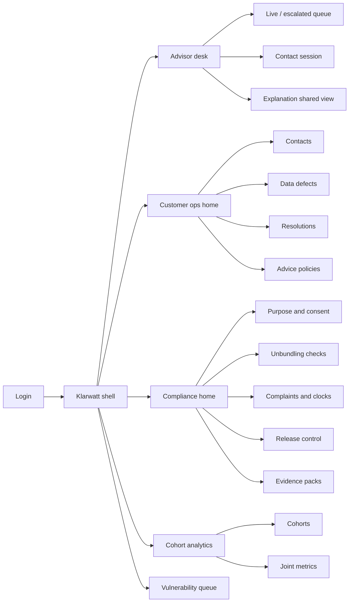
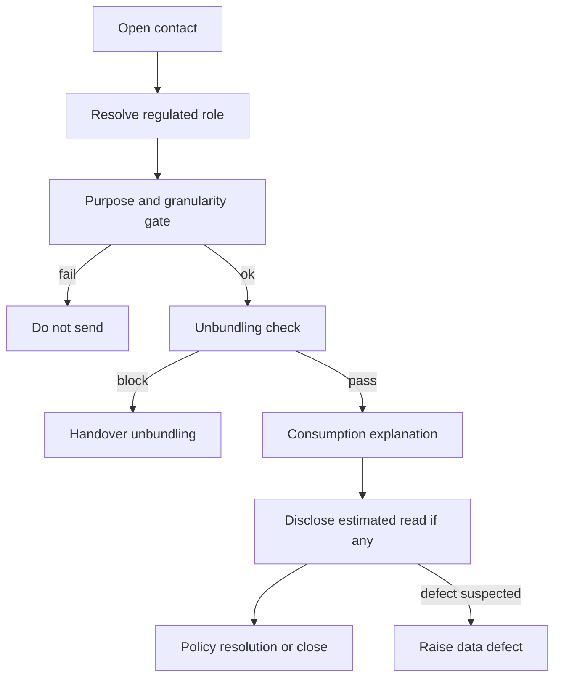
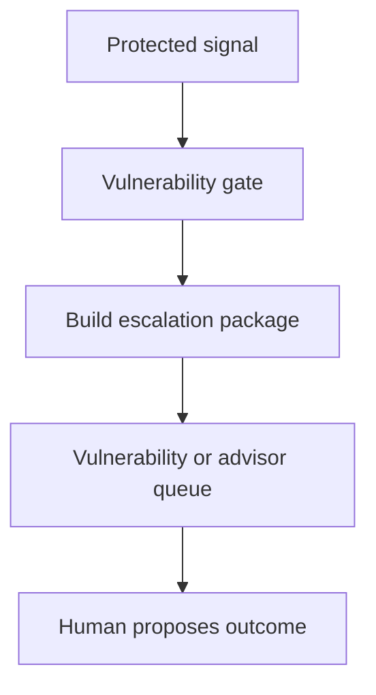

# Klarwatt — Web app

**Product:** [PRODUCT.md](./PRODUCT.md)
**Primary surface:** Regulated contact-resolution console (advisor desk + operations/compliance shell under one Klarwatt brand)
**Secondary surfaces:** Customer-facing explanation and consent capture surfaces embedded in supplier channels (read-through of the same decomposition); ombudsman evidence-pack export viewer (read-only)
**Design thesis:** Klarwatt is a licence-condition desk that happens to automate answers — the UI metaphor is a gated resolution bench, not a chatbot analytics wallboard. Every screen makes visible the three gates that must clear before an utterance leaves the system: declared regulated role, lawful purpose with metering granularity ceiling, and vulnerability status that cannot be waived. Visual language is cool grid-slate and purpose-cleared cyan on a deep utility ground; vulnerability and complaint clocks interrupt in amber that cannot be dismissed as “insight.” The Klarwatt wordmark sits as a quiet mint seal on every purpose-bound and money-adjacent view so operators always know whose regulated voice is speaking.

## UX research synthesis

### Category peers (best-in-class)

- **Octopus Energy Kraken (advisor / ops):** Account timeline with bill and meter events in one thread; advisors continue rather than restart. Steal: escalation packages that arrive with conversation + data used + reason as the default desk layout; reject Kraken’s consumer-playful brand chrome for a licence-grade operator shell.
- **Salesforce Energy & Utilities Cloud / Service Cloud for Utilities:** Priority Services Register flags, case types for payment difficulty, omnichannel case continuity. Steal: vulnerability status as a non-optional header on the contact — never a buried attribute; reject Salesforce’s generic “AI recommended reply” tray when Klarwatt’s reply must prove purpose and data used (BR-1).
- **Oracle Utilities Customer Care and Billing (self-service + CSR):** Estimated vs actual read disclosure and bill-factor drill-downs. Steal: named bill drivers the customer can verify; reject raw half-hourly sparklines as the primary answer when a monthly total would settle the question (BR-9).
- **Genesys Cloud / NICE CXone (agent desktop):** Softphone + transcript + disposition with mandatory fields before wrap. Steal: unwaivable disposition paths for protected intents (arrears, disconnection, safeguarding); reject containment-rate dashboards that hide complaint rate and first-contact resolution (BR-7).

### Patterns to adopt / reject

- **Adopt:** Dual view of the same consumption decomposition for customer channel and advisor desk; purpose + granularity chip on every data-bearing panel; vulnerability gate as blocking chrome (not a toast); complaint clock that starts the moment dissatisfaction is recognised; joint metrics (cost per resolved contact × FCR × complaint rate) as inseparable columns; cohort scale-or-stop as a dated decision object; advisor correction that excludes the contact from resolution success.
- **Reject:** Knowledge-base chatbot home as the product; rainbow “AI containment” tiles; editable totals on explanations; purple “copilot” glow; card grids of static KPIs; configuration that can mute the vulnerability gate; winter-overstated pilots without weather/price adjustment.

### Trust, density, and workflow constraints from PRODUCT.md

Operators work under licence conditions on billing accuracy, complaint handling, and customers in payment difficulty (BR-3, BR-4, BR-10): density must be finance- and regulator-grade without exposing network-side data across the unbundling boundary (BR-2). Purpose and consent are runtime inputs, not policy PDFs (BR-1, BR-9) — the UI must refuse to render an explanation that cannot state data used and purpose. Advisor trust is the adoption gate (BR-11): handovers without full context cause routing around the system. Pilots that cannot stop are not pilots (BR-8); cohort decision dates and unpenalised stop outcomes must be first-class screens. Seasonal volume and batch metering lag must be disclosed, not smoothed into false currency.

## Information architecture

### Nav model

### Roles → default home

| Role | Default home | Why |
|------|--------------|-----|
| Contact centre advisor | Live / escalated queue | Continue conversations with context (BR-11) |
| Team leader | Customer ops home — escalate intents | Staff to real demand |
| Vulnerability / priority services | Vulnerability queue | Unwaivable human handling (BR-3) |
| Billing / revenue ops | Data defects | Metering defects from wrong explanations (BR-6) |
| Compliance / DPO | Compliance home — purpose and unbundling | Regulator-ready records (BR-1, BR-2) |
| Regulatory reporting | Complaints and clocks | Same clock as advisor complaints (BR-4) |
| Retail analytics / platform owner | Cohort analytics | Scale-or-stop with decision date (BR-8, BR-12) |

### Cross-links to OpenAPI resources

| Nav area | OpenAPI tags / resources |
|----------|---------------------------|
| Contacts, session, handover | Contacts |
| Consumption explanation, estimated reads, defects | Consumption |
| Purpose, consent, withdrawal | Consent |
| Vulnerability flags and gate policy | Vulnerability |
| Payment plans, policy resolutions | Resolutions |
| Energy advice recommendations | Advice |
| Complaint cases and clocks | Complaints |
| Pilot cohorts, metrics, decisions | Cohorts |
| Unbundling, releases, evidence packs | Compliance |

## Screen inventory

### Advisor desk home (live / escalated queue)

- **Purpose:** Show which contacts need a human now, with gate reason and package completeness visible before accept.
- **Entry:** Default post-login for advisor roles; deep link from vulnerability transfer.
- **Layout regions:** Klarwatt brand + role badge (supplier / network / affiliated — read-only for the session); queue table (channel, wait, escalation reason, vulnerability flag, package completeness); filters for vulnerability-only and complaint-clock running; soft alerts for SLA on complaint clocks.
- **Primary actions:** Accept next; open session; filter by reason; mark unavailable.
- **Empty / loading / error:** Empty = “No escalations — automation holding under load” with link to ops metrics; loading = skeleton rows; error = queue feed retry with request id.
- **BR / story ties:** BR-3, BR-11; advisor and vulnerability officer stories.

### Contact session (advisor handover)

- **Purpose:** Continue the conversation without restart — conversation, data used, purpose, decomposition, and proposed next step in one composition.
- **Entry:** Accept from queue; open from Contacts list.
- **Layout regions:** Sticky gate strip (regulated role, purpose, granularity ceiling, vulnerability state); transcript pane; ConsumptionExplanation panel identical to what the customer saw; data-used list with purpose pairing; resolution / complaint status; actions rail (continue, correct explanation, open complaint, raise data defect).
- **Primary actions:** Send reply; mark explanation wrong (exclude from resolution metrics); open complaint; escalate to vulnerability team; raise data defect.
- **Empty / loading / error:** Incomplete package = blocking banner listing missing fields (BR-11); loading = skeleton transcript + explanation; error = session reconstruct failure with version id.
- **BR / story ties:** BR-1, BR-5, BR-6, BR-11; advisor stories.

### Customer ops home

- **Purpose:** Answer “are we resolving bill-shock contacts or deflecting them?” with joint metrics inseparable.
- **Entry:** Default for team leaders / customer ops directors.
- **Layout regions:** Joint KPI strip (cost per resolved contact, first-contact resolution, complaint rate — never shown as a single containment number); channel mix; top escalate intents; seasonal / weather-adjusted note; alerts (cohort decision dates due, release pending approval).
- **Primary actions:** Open contacts; open cohort approaching decision; drill to escalate intent.
- **Empty / loading / error:** Empty pilot = guided “create first cohort”; error = metrics unavailable with last good stamp.
- **BR / story ties:** BR-7, BR-8; team leader and analytics stories.

### Contacts explorer

- **Purpose:** Search and filter contact sessions by outcome, channel, role, and complaint state for ops and compliance review.
- **Entry:** Ops nav → Contacts.
- **Layout regions:** Filter bar (outcome: resolved / escalated / abandoned / blocked_by_policy; channel; date); results table with pinned release version; side drawer for session summary.
- **Primary actions:** Open session; export filtered slice for audit; jump to complaint.
- **Empty / loading / error:** Empty filters = adjust range; loading = skeleton table.
- **BR / story ties:** BR-12; compliance reconstruction stories.

### Explanation shared view

- **Purpose:** Show the named, quantified bill drivers (weather, tariff, consumption, estimated-read correction, standing/network charges) as the commercial object — not a raw graph.
- **Entry:** From session; from customer channel preview; from Contacts drill-down.
- **Layout regions:** Driver stacked breakdown with currency amounts; estimated-read disclosure callout when applicable; purpose + granularity chip; confidence / data currency note (e.g. nightly batch lag); advisor-correction badge if marked wrong.
- **Primary actions:** Copy customer-safe summary; open estimated-read detail; raise data defect.
- **Empty / loading / error:** Cannot produce purpose statement → do not render explanation (hard empty with BR-1 block); loading = skeleton drivers.
- **BR / story ties:** BR-5, BR-6, BR-9; residential customer stories.

### Purpose and consent

- **Purpose:** Make lawful purpose and metering granularity ceiling operable — consent capture/withdrawal as runtime controls.
- **Entry:** Compliance nav; session deep link when finer granularity required.
- **Layout regions:** Purpose catalogue with max granularity per purpose; consent records table; withdrawal action with next-interaction effect callout; interaction samples showing ceiling applied.
- **Primary actions:** Record consent; withdraw consent; review purpose catalogue.
- **Empty / loading / error:** No consent for fine granularity = force coarse path explanation; error = consent store unavailable (block fine path).
- **BR / story ties:** BR-1, BR-9; DPO stories.

### Vulnerability queue and gate policy

- **Purpose:** Surface protected contacts and prove the gate is unwaivable in configuration.
- **Entry:** Vulnerability role default; ops alert.
- **Layout regions:** Priority queue (arrears, disconnection, self-disconnection, medical dependence, safeguarding); case header with PSR/vulnerability register status; gate policy viewer (read-only for commercial roles — no mute control); transfer history.
- **Primary actions:** Take case; document outcome; view gate policy attestation.
- **Empty / loading / error:** Empty = healthy “no open protected contacts”; attempt to show containment toggle = not present (by design).
- **BR / story ties:** BR-3; vulnerability officer stories.

### Complaints and regulatory clocks

- **Purpose:** Treat dissatisfaction recognised in automation with the same clock as advisor-raised complaints.
- **Entry:** Compliance / regulatory reporting nav; session action.
- **Layout regions:** Open complaints with clock countdown; source (automated vs advisor); linked session and release version; ombudsman-ready package status.
- **Primary actions:** Open case; generate evidence pack; escalate to ombudsman workflow.
- **Empty / loading / error:** Empty = no open clocks; overdue = coral blocking row state.
- **BR / story ties:** BR-4; compliance stories.

### Data defects

- **Purpose:** Turn patterns of wrong explanations into billing/MDM work items rather than script tweaks.
- **Entry:** Billing ops default; session “raise defect.”
- **Layout regions:** Defect queue (suspected estimated-read / settlement issues); linked explanations; meter point; status in billing ops.
- **Primary actions:** Triage; mark fixed; notify related cohort owners.
- **Empty / loading / error:** Empty = no open defects with link to explanation quality metrics.
- **BR / story ties:** BR-6; platform owner story.

### Resolutions and advice policies

- **Purpose:** Bound payment plans, tariff eligibility, and advice to approved policy — block out-of-policy commitments.
- **Entry:** Ops nav → Resolutions / Advice.
- **Layout regions:** Policy catalogue; recent resolution attempts (executed vs blocked_by_policy); advice recommendations with savings estimate + confidence + purpose ceiling.
- **Primary actions:** Review blocked attempts; update policy (with release approval path); preview advice at coarse vs fine granularity.
- **Empty / loading / error:** Policy missing = block resolution with explicit reason.
- **BR / story ties:** BR-10; advice capability.

### Cohort analytics and scale-or-stop

- **Purpose:** Run each capability inside a comparison group with a decision date; stopping is recorded and unpenalised.
- **Entry:** Analytics default; ops alert when decision date nears.
- **Layout regions:** Cohort list (capability, start, decision date, comparison group); joint metrics with weather and price-event adjustment toggles; decision panel (scale / stop) with named approver; history of stopped cohorts (not hidden).
- **Primary actions:** Create cohort; record decision; export board pack.
- **Empty / loading / error:** Capability without cohort = warning that live traffic without a decision date is out of policy (BR-8).
- **BR / story ties:** BR-7, BR-8; retail analytics stories.

### Release control

- **Purpose:** Version every capability change with named approver; pin interactions to the version that served them.
- **Entry:** Compliance / platform owner nav.
- **Layout regions:** Release list (version, approver, capability); diff summary; interactions reconstruct sample.
- **Primary actions:** Submit release; approve; roll forward; open evidence by version.
- **Empty / loading / error:** Pending approval queue empty state; rejected release shows reason.
- **BR / story ties:** BR-12.

### Unbundling checks and evidence packs

- **Purpose:** Demonstrate role boundary enforcement and produce ombudsman-ready packs (conversation, data used, version, escalations).
- **Entry:** Compliance home.
- **Layout regions:** Unbundling check log (pass/block); role declaration samples; evidence pack builder (session range, complaint id); export status.
- **Primary actions:** Generate pack; download; attest integrity.
- **Empty / loading / error:** Attestation failure = red blocking state; empty pack criteria = guided select.
- **BR / story ties:** BR-2, BR-12; compliance ombudsman story.

## Key flows

1. **Bill-shock resolution** — contact opens → role resolved → purpose/granularity gate → unbundling check → explanation with drivers → optional policy resolution; failure: purpose cannot be stated (block send), or estimated-read defect raised to billing.

2. **Vulnerability intercept** — intent or signal hits arrears/disconnection/medical/safeguarding → gate fires → transfer to trained human before any outcome; configuration cannot mute.

3. **Complaint clock in automation** — dissatisfaction recognised → complaint logged → regulatory clock starts → evidence accumulates → ombudsman pack if escalated (BR-4).

4. **Advisor correction** — advisor marks explanation wrong → contact excluded from resolution success metrics → optional data defect → same decomposition retained for audit.

5. **Cohort scale-or-stop** — capability in cohort → joint metrics with weather/price adjustment → decision date → scale or stop recorded without penalty (BR-8).

## Design system

### Tokens (CSS variables)

- `--color-ink: #E6EEF2` — primary text on dark ground
- `--color-grid-950: #0A1216` — app ground
- `--color-grid-900: #121C22` — panels
- `--color-grid-700: #2A3A44` — rules/dividers
- `--color-purpose: #3DB8C5` — purpose-cleared / explanation confirmed (cyan, not neon)
- `--color-purpose-dim: #1A6A72` — cyan on dark
- `--color-amber: #E6A23C` — vulnerability / complaint clock / provisional
- `--color-coral: #E85D4C` — gate block / overdue clock / unbundling block
- `--color-steel: #7A96A8` — secondary labels
- `--color-brand: #9FCBD4` — Klarwatt wordmark accent (quiet mint-cyan)
- `--font-display: "Source Serif 4", Georgia, serif` — screen titles and driver amounts (authority, not marketing flourish)
- `--font-body: "IBM Plex Sans", sans-serif` — console chrome and body
- `--font-mono: "IBM Plex Mono", monospace` — session ids, release versions, purpose codes
- `--space-1`…`--space-8`: 4px scale
- `--radius-sm: 4px`; `--radius-md: 8px` — sharp regulated desk, not pill-heavy
- `--motion-gate: 160ms ease-out` — gate strip confirm
- `--motion-clock: 240ms ease-in-out` — amber pulse on complaint deadline
- `--motion-handover: 200ms ease-out` — package completeness fill
- Atmosphere: subtle vertical “meter tape” hairlines in grid-900; cool top vignette; no stock solar-farm heroes in console; customer channel may use supplier brand with Klarwatt as quiet processor mark.

### Typography & brand

- Serif display for explanation totals and screen titles; sans for ops density; mono for ids, versions, purpose codes.
- Brand wordmark left of shell chrome on every purpose-bound and money-adjacent view; never replaced by “Dashboard” as the strongest mark.
- Login / marketing shell: brand as hero-level signal; one headline (“Answers the bill — inside the licence”); one CTA — no containment stat strips.

### Do / don’t

- **Do:** Keep role / purpose / vulnerability visible on session chrome; show joint metrics as three linked numbers; render the same driver breakdown for customer and advisor; make stop a first-class cohort outcome; disclose estimate and batch lag.
- **Don’t:** Purple AI glow; single containment KPI; muteable vulnerability toggle; raw interval graphs as the primary answer; card grids for static metrics; emoji status; rounded-full pills for every filter.

### Accessibility & domain trust cues

- Contrast AA+ on purpose cyan / amber / coral against grid; do not rely on colour alone — gates also use text + icon (Cleared / Blocked / Human required).
- Live regions announce vulnerability transfers and complaint clock changes.
- Focus order follows resolution path: purpose → explanation → resolution → complaint.
- Evidence packs expose machine-readable interaction + version for auditors.

## Component patterns

- **GateStrip** — sticky regulated role + purpose + granularity + vulnerability state.
- **DriverBreakdown** — named quantified bill drivers with verify-friendly amounts.
- **EstimatedReadCallout** — estimate and correction disclosure in the answer.
- **EscalationPackage** — conversation + data used + reason + proposed next step completeness meter.
- **JointMetricTrio** — cost per resolved contact, FCR, complaint rate locked as one component.
- **ComplaintClock** — amber countdown; coral when overdue.
- **VulnerabilityBanner** — unwaivable transfer state; no dismiss that continues automation.
- **CohortDecisionCard** — decision date, comparison group, scale/stop with named approver.
- **ReleasePin** — capability version badge on every reconstructible session.
- **EvidencePackExport** — ombudsman bundle builder.

## Out of scope for v1 web

- Full contact-centre ACD/telephony admin; consumer mobile app owned by the supplier brand (Klarwatt embeds explanation/consent widgets only); headset/IVR voice UI design beyond session APIs; network-operator field-force apps; wholesale/settlement trader screens; generic marketing CDP or upsell studio; works-council HR planning tools.
